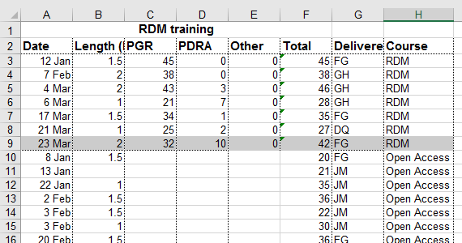
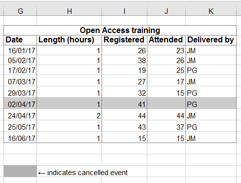
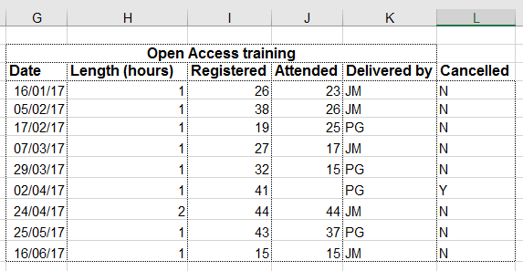

## Common Spreadsheet Errors

- [Multiple tables](#tables)
- [Multiple tabs](#tabs)
- [Not filling in zeros](#zeros)
- [Using bad null values](#null)
- [Using formatting to convey information](#formatting)
- [Using formatting to make the data sheet look pretty](#formatting_pretty)
- [Placing comments or units in cells](#units)
- [More than one piece of information in a cell](#info)
- [Field name problems](#field_name)
- [Special characters in data](#special)
- [Inclusion of metadata in data table](#metadata)
- [Date formatting]()

---

## Multiple tables {#tables}

A common strategy is creating multiple data tables within one
spreadsheet. **This confuses the computer, so don't do this!** When
you create multiple tables within one spreadsheet, you’re drawing
false associations between things for the computer, which sees each
row as an observation. You’re also potentially using the same field
name in multiple places, which will make it harder to clean your data
up into a usable form. The example below depicts the problem:

>## Solution: {#tablesolution}
>
> 
>

## Multiple tabs {#tabs}

But what about worksheet tabs? That seems like an easy way to organize data, right? Well, yes and no. When you create extra tabs, you fail to allow the computer to see connections in the data that are there (you have to introduce spreadsheet application-specific functions or scripting to ensure this connection). Say, for instance, you make a separate tab for each year.

This is bad practice for two reasons:
**1)** you are more likely to accidentally add inconsistencies to your data if each time you take a measurement, you start recording data in a new tab, and
**2)** even if you manage to prevent all inconsistencies from creeping in, you will add an extra step for yourself before you analyze the data because you will have to combine these data into a single datatable. You will have to explicitly tell the computer how to combine tabs - and if the tabs are inconsistently formatted, you might even have to do it by hand!

The next time you’re entering data, and you go to create another tab or table, I want you to ask yourself “Self, could I avoid adding this tab by adding another column to my original spreadsheet?”

Your data sheet might get very long over the course of recording data. This makes it harder to enter data if you can’t see your headers at the top of the spreadsheet. But do NOT repeat headers. These can easily get mixed into the data, leading to problems down the road.

Instead you can Freeze the column headers.

[Documentation on how to freeze column headers in Microsoft Excel](https://support.office.com/en-ca/article/Freeze-column-headings-for-easy-scrolling-57ccce0c-cf85-4725-9579-c5d13106ca6a)

[Documentation on how to freeze column headers in LibreOffice Calc](https://help.libreoffice.org/Calc/Freezing_Rows_or_Columns_as_Headers)

## Not filling in zeroes {#zeros}

It might be that when you're measuring something, it's
usually a zero, say the number of participants at a training event. Why bother
writing in the number zero in that column, when it's mostly zeros?

However, there's a difference between a zero and a blank cell in a spreadsheet. To the computer, a zero is actually data. You measured or counted it. A blank cell means that it wasn't measured and the computer will interpret it as a null value.

The spreadsheets or statistical programs will likely mis-interpret blank cells that are meant to be zero. This is equivalent to leaving out data. Zero observations are real data! Leaving zero data blank is not good in a written format, but NEVER okay when you move your data into a digital format.

## Using bad null values {#null}

**Example**: using -999 or other numerical values (or zero).

**Solution**: Many statistical programs will not recognize that numeric values of null are indeed null. It will depend on the final application of your data and how you intend to analyse it, but it is essential to use a clearly defined and CONSISTENT null indicator. Blanks (most applications) and NA (for R) are good choices.

From White et al, 2013, [Nine simple ways to make it easier to (re)use your data.](https://ojs.library.queensu.ca/index.php/IEE/article/view/4608) Ideas in Ecology and Evolution:

## Using formatting to convey information  {#formatting}

**Example**: highlighting cells, rows or columns that should be excluded from an analysis, leaving blank rows to indicate separations in data.

**Solution**: create a new field to encode which data should be excluded.

## Using formatting to make the data sheet look pretty {#formatting_pretty}

**Example**: merging cells.

**Solution**: If you’re not careful, formatting a worksheet to be more aesthetically pleasing can compromise your computer’s ability to see associations in the data. Merged cells are an absolute formatting NO-NO if you want to make your data readable by statistics software. Consider restructuring your data in such a way that you will not need to merge cells to organize your data.

## Placing comments or units in cells {#units}

**Example**: Your data was collected, in part, by a summer student who you later found out was mis-recording the duration of training sessions, some of the time. You want a way to note these data are suspect.

**Solution**: Most statistical programs can’t see Excel’s comments, and would be confused by comments placed within your data cells. As described above for formatting, create another field if you need to add notes to cells. Similarly, don’t include units in cells (such as "hours"): ideally, all the units or measurements you place in one column should be in the same, but if for some reason they aren’t, create another field and specify the units.

## More than one piece of information in a cell {#info}

**Example**: 
You had multiple instructors delivering the workshop. For example, you enter this as GQ & DF.

**Solution**: 
Never include more than one piece of information in a cell. If you need both these instructor initials, design your data sheet to include this information.

## Field name problems {#field_name}
Choose descriptive field names, but be careful not to include: spaces, numbers, or special characters of any kind. Spaces can be misinterpreted by parsers that use whitespace as delimiters and some programs don’t like field names that are text strings that start with numbers.
Underscores (`_`) are a good alternative to spaces and consider writing names in camel-case to improve readability. Remember that abbreviations that make sense at the moment may not be so obvious in 6 months but don't overdo it with names that are excessively long. Including the units in the field names avoids confusion and enables others to readily interpret your fields.

**Examples**  

| Good Name          | Good Alternative   | Avoid                |
|--------------------+--------------------+----------------------|
| Max\_temp\_C       | MaxTemp            | Maximum Temp (°C)    |
| Precipitation\_mm  | Precipitation      | precmm               |
| Mean\_year\_growth | MeanYearGrowth     | Mean growth/year	 |
| sex                | sex                | M/F                  |
| weight             | weight             | w.                   |
| cell\_type         | CellType           | Cell Type            |
| Observation\_01    | first\_observation | 1st Obs              |

## Special characters in data {#special}

**Example**: You treat Excel as a word processor when writing notes, even copying data directly from Word or other applications.

**Solution**: This is a common strategy. For example, when writing longer text in a cell, people often include line breaks, em-dashes, et al in their spreadsheet.  Worse yet, when copying data in from applications such as Word, formatting and fancy non-standard characters (such as left- and right-aligned quotation marks) are included.  When exporting this data into a coding/statistical environment or into a relational database, dangerous things may occur, such as lines being cut in half and encoding errors being thrown.

General best practice is to avoid adding characters such as newlines, tabs, and vertical tabs.  In other words, treat a text cell as if it were a simple web form that can only contain text and spaces.

## Inclusion of metadata in data table {#metadata}

**Example**: You add a legend at the top or bottom of your data table explaining column meaning, units, exceptions, etc.

**Solution**: While recording data about your data ("metadata") is essential, this information should not be contained in the data file itself. Unlike a table in a paper or a supplemental file, metadata (in the form of legends) should not be included in a data file since this information is not data, and including it can disrupt how computer programs interpret your data file. Rather, metadata should be stored as a separate file in the same directory as your data file, preferably in plain text format with a name that clearly associates it with your data file. Because metadata files are free text format, they also allow you to encode comments, units, information about how null values are encoded, etc. that are important to document but can disrupt the formatting of your data file.

